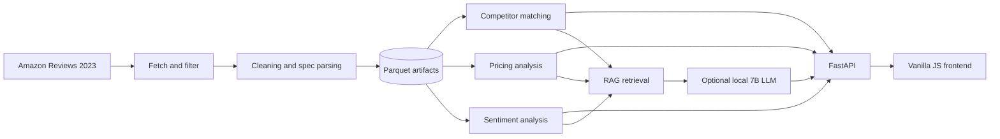

# Laptop Competitor Intelligence

An end-to-end competitor-intelligence system built from the Amazon Reviews 2023 laptop corpus. It combines structured specification parsing, hybrid competitor matching, price-position analysis, aspect-level review sentiment, and retrieval-augmented question answering in a browser application.

The primary interface is a FastAPI backend with a vanilla JavaScript frontend. The language model is optional: product search, competitor matching, pricing, and review analysis work without loading the 7B model.

## Highlights

- Search and filter 25,841 de-duplicated laptop listings.
- Find competitors using text embeddings and normalized hardware specifications.
- Apply segment, price-band, product-variant, brand-diversity, and renewed-product guards.
- Compare price positioning across brands and market segments.
- Explore sentiment for performance, battery, display, keyboard, build quality, thermals, value, and support.
- View customer-review evidence behind sentiment results.
- Ask catalogue questions through a grounded RAG agent with citations and a post-generation audit.
- Preserve missing-data honesty: an unavailable price is never represented as `$0`.

## Dataset snapshot

| Artifact | Size / coverage |
|---|---:|
| Products | 25,841 listings |
| Retained reviews | 456,395 reviews |
| Products with a listed price | 7,875 (30.5%) |
| Products with mined sentiment | 25,831 (99.96%) |
| Product embeddings | 25,841 × 384 |
| Market segments | 6 |

Price statistics describe only the priced subset and are returned with their sample size and coverage. Brand or segment statistics based on fewer than five priced products are marked unreliable.

## Architecture



## Repository structure

```text
project_final/
├── data/
│   ├── raw/                    # Filtered Amazon metadata and reviews
│   └── processed/              # Catalogue, embeddings, and sentiment artifacts
├── eval/
│   ├── pricing_eval.json       # Pricing validation results
│   └── sentiment_eval.json     # Sentiment validation results
├── report/                     # Project report files (ignored by Git)
├── scripts/
│   ├── fetch_data.py           # Streams and filters the source dataset
│   └── make_docx.py            # Builds the DOCX report
├── src/
│   ├── config.py               # Paths, schema, model names, and segment definitions
│   ├── pipeline.py             # Cleaning, parsing, de-duplication, and segmentation
│   ├── matching.py             # Hybrid competitor matcher
│   ├── pricing.py              # Coverage-aware price analysis
│   ├── sentiment.py            # Review and aspect sentiment
│   ├── rag.py                  # Retrieval, generation, citations, and audit
│   ├── app.py                  # Superseded Streamlit interface
│   └── web/
│       ├── api.py              # FastAPI backend and static-file server
│       ├── test_api.py         # End-to-end API tests
│       └── static/             # HTML, CSS, and JavaScript frontend
├── requirements.txt
└── README.md
```

## Requirements

- Python 3.12 is recommended.
- Approximately 1 GB of free disk space for the included and generated data artifacts.
- An internet connection is needed only when downloading the dataset or model weights.
- NVIDIA CUDA is required only for generated RAG answers.

The normal dashboard works on macOS, Linux, and CPU-only systems. The current generated-chat implementation is designed for an NVIDIA GPU and checks `nvidia-smi` before loading the model.

## Local setup

From the repository root:

```bash
python3.12 -m venv .venv
source .venv/bin/activate
python -m pip install --upgrade pip
python -m pip install -r requirements.txt
```

The web layer has three direct dependencies that are not currently declared in `requirements.txt`. Install them as well:

```bash
python -m pip install fastapi "uvicorn[standard]" httpx
```

### Dashboard-only installation

If you do not need to rebuild sentiment models or run generated chat, install the smaller web-oriented environment:

```bash
python -m pip install \
  pandas numpy pyarrow scipy scikit-learn sentence-transformers \
  requests tqdm fastapi "uvicorn[standard]" httpx
```

## Run the application

Start the FastAPI server from the repository root:

```bash
python -m src.web.api
```

Open:

- Application: <http://127.0.0.1:8000/>
- Interactive API documentation: <http://127.0.0.1:8000/docs>
- Health and artifact status: <http://127.0.0.1:8000/api/health>

Development mode with automatic reload:

```bash
python -m src.web.api --reload
```

## API endpoints

| Method | Endpoint | Purpose |
|---|---|---|
| `GET` | `/api/health` | Runtime, artifact, cache, and model status |
| `GET` | `/api/products/search` | Paginated catalogue search and filters |
| `GET` | `/api/products/{asin}` | Product specifications and market position |
| `GET` | `/api/products/{asin}/competitors` | Guarded hybrid competitor ranking |
| `GET` | `/api/products/{asin}/reviews` | Aspect profile and review evidence |
| `GET` | `/api/segments` | Segment price statistics and coverage |
| `GET` | `/api/brands` | Brand price statistics and reliability |
| `GET` | `/api/market/overview` | Headline catalogue analysis |
| `GET` | `/api/chat/status` | Optional LLM availability |
| `POST` | `/api/chat` | Grounded answer with evidence and audit |

## Test the project

Run the end-to-end API suite without loading the LLM:

```bash
python src/web/test_api.py
```

The suite exercises the product, competitor, review, segment, brand, market, and chat-status endpoints. It also verifies that API responses contain valid JSON and never expose `NaN` or infinite values to the browser.

Additional checks:

```bash
python -m compileall -q src scripts
python -m doctest src/pipeline.py src/sentiment.py
python src/matching.py --asin B07L7DVDL3 -k 5
python src/rag.py -q 'Which gaming laptops under $1200 are good?' --retrieval-only
```

## Optional RAG generation

Retrieval-only mode uses the MiniLM encoder and does not load the 7B language model:

```bash
python src/rag.py \
  -q 'Compare the Acer Predator Helios 300 with the ASUS TUF Gaming A15' \
  --retrieval-only
```

Full generation uses `unsloth/Qwen2.5-7B-Instruct-bnb-4bit` and requires:

- A working NVIDIA CUDA installation.
- `nvidia-smi` available on `PATH`.
- Roughly 6 GB of free VRAM.
- The approximately 5.5 GB model checkpoint in the Hugging Face cache, or internet access for its first download.

```bash
python src/rag.py -q 'What are the best-value gaming laptops under $1200?'
```

On a CPU-only system or Apple Silicon Mac, use retrieval-only mode. The rest of the web application remains available if generation cannot start.

## Rebuild the data artifacts

The repository's `.gitignore` excludes the three source/generated files larger than GitHub's normal file limit:

- `data/raw/laptops_meta.jsonl`
- `data/raw/laptops_reviews.jsonl`
- `data/processed/reviews.parquet`

To rebuild everything from the source dataset:

```bash
python scripts/fetch_data.py
python src/pipeline.py
python src/matching.py --rebuild
python src/sentiment.py --full --device cuda
```

Fetching, embedding, and full sentiment processing can take significant time. The final sentiment command is designed for CUDA; `--device cpu` is available but considerably slower.

Useful alternatives:

```bash
# Fast sentiment baseline
python src/sentiment.py --full --backend vader --device cpu

# Reuse the existing embedding index and run its self-test
python src/matching.py

# Run pricing analysis from the processed catalogue
python src/pricing.py
```

## Analytical design

### Competitor matching

The matcher blends cosine similarity from `all-MiniLM-L6-v2` product embeddings with a masked structured distance over CPU tier, RAM, storage, screen size, GPU type, and price. A configurable guard removes incompatible market segments, implausible price-band matches, duplicate model variants, and optionally same-brand or renewed listings.

### Pricing

Pricing functions always report the number and coverage of priced products. They include segment and brand summaries, percentile positioning, discrete-GPU premiums, price/rating relationships, and a regularized specification-based value model.

### Sentiment

Reviews are split into clauses, mapped to eight product aspects using cue patterns, and scored with a transformer model. A VADER backend is retained as a faster baseline. Product-level artifacts store aggregate polarity, positive share, mention counts, and ranked praise/complaint snippets.

### RAG and grounding

Question parsing and evidence retrieval are deterministic. Product, review, and market-statistic evidence blocks receive markers such as `[P1]`, `[R1]`, and `[S1]`. After generation, an audit checks unsupported markers, uncited statements, unverified numbers, and reviews attributed to the wrong product.

## Known limitations

- Only 30.5% of listings contain a price, so price conclusions apply to the priced subset.
- Product specifications are parsed from noisy marketplace text and may occasionally be incomplete.
- Aspect detection is cue-based and can miss inflections or misread ambiguous words.
- The generated-chat path is NVIDIA-specific and unavailable on Apple Silicon without code changes.
- The legacy Streamlit interface in `src/app.py` is retained for reference but is not the recommended application entry point.

## Data source

Hou, Y., Li, J., He, Z., Yan, A., Chen, X., and McAuley, J. (2024). *Bridging Language and Items for Retrieval and Recommendation.* Amazon Reviews 2023, McAuley Lab, UC San Diego.

Dataset website: <https://amazon-reviews-2023.github.io/>
